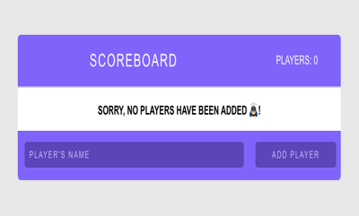
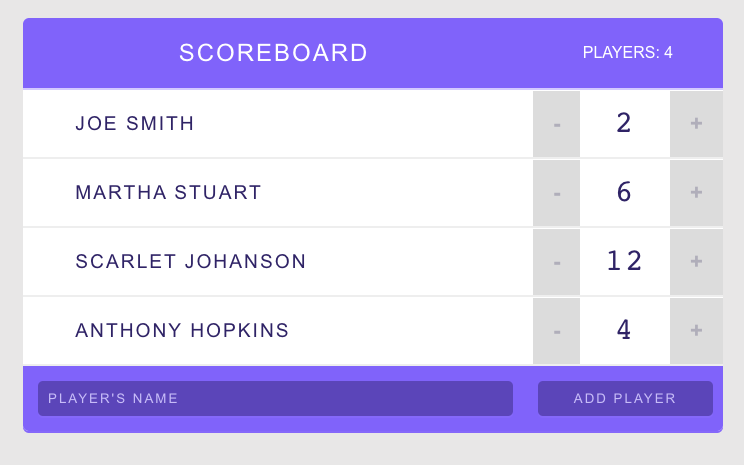

# Scoreboard React App
## Table of contents

- [Scoreboard React App](#scoreboard-react-app)
  - [Table of contents](#table-of-contents)
  - [Overview](#overview)
    - [Screenshot](#screenshot)
    - [Links](#links)
    - [Built with](#built-with)
  - [Author](#author)

**Note: Delete this note and update the table of contents based on what sections you keep.**

## Overview
In this application, the user can enter a person name and give it a score.  The added person could be deleted, or their score could be increased/decreased.

### Screenshot

### Links

- Live Site URL: [Scoreboard](https://batistadev1113.github.io/scoreboard/)

### Built with

- Semantic HTML5 markup
- CSS custom properties
- Flexbox
- CSS Grid
- Mobile-first workflow
- [React](https://reactjs.org/) - JS library
  

## Author

- Website - [Yunior](https://yuniorbatista.com)
- LinkedIn - [My Profile](https://www.linkedin.com/in/yunior-batista-profile/)

